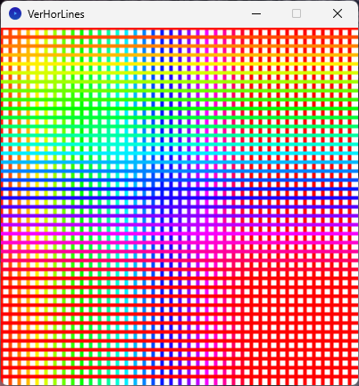
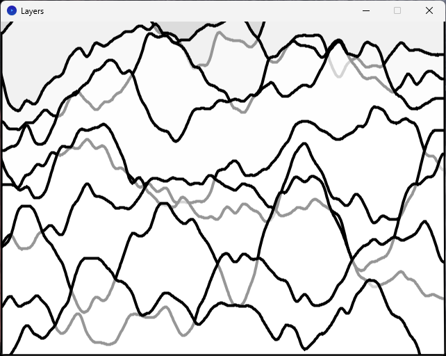
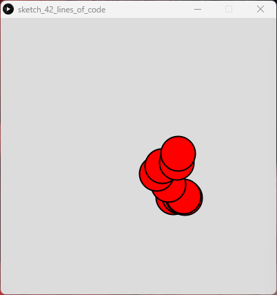
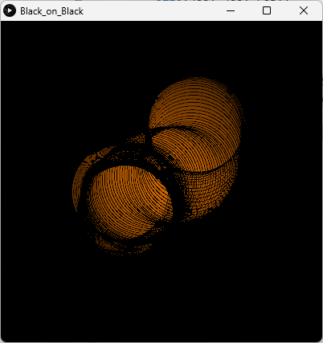
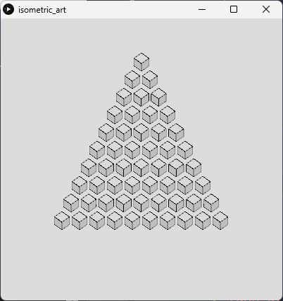
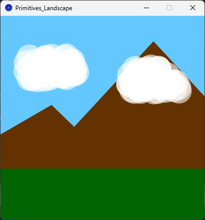
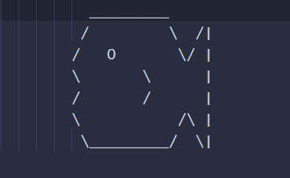
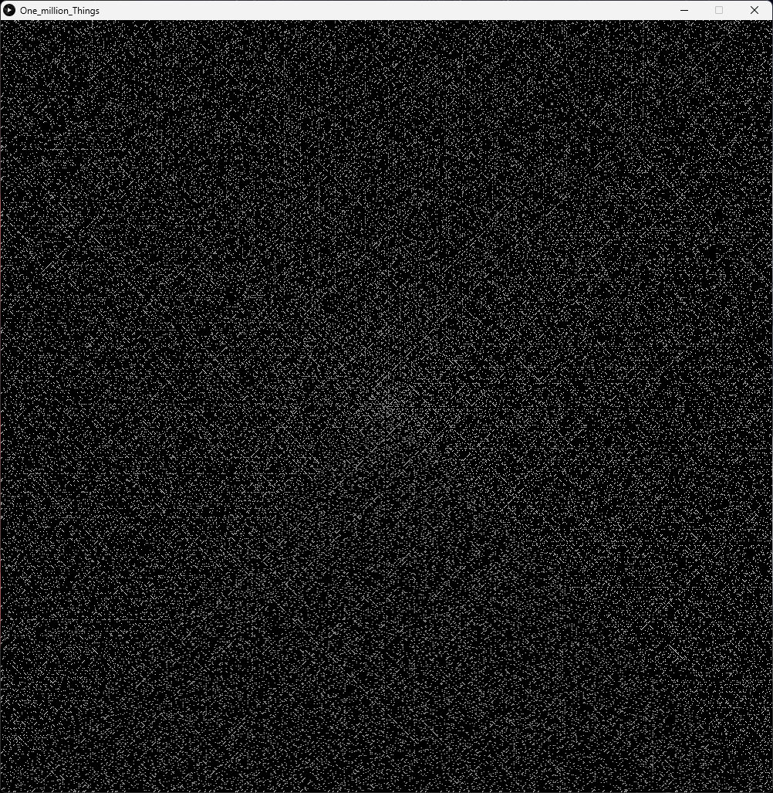
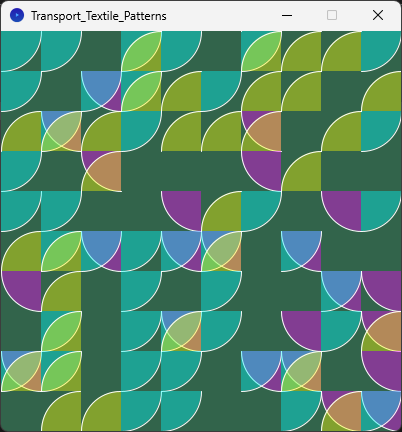

# Genuary 2025 Speed run by Daniel Shiffman

This is my version Genuary 2025 in Processing - Python mode.

[The Genuary 2025 website with all prompts](https://genuary.art/)

Daniel Shiffman live code in P5.JS on Youtube link:

[Watch the archive of the live stream](https://www.youtube.com/watch?v=c1BPd8omBro)

## Genuary 1

[Vertical or horizontal lines only](VerHorLines)

## Genuary 2

[Layers upon layers upon layers](Layers)

## Genuary 3

[Exactly 42 lines of code](sketch_42_lines_of_code)

## Genuary 4

[Black on black](Black_on_Black)

## Genuary 5

[Isometric Art - No vanishing points](isometric_art)

## Genuary 6

[Make a landscape using only primitive shapes](Primitives_Landscape)

## Genuary 7

[Use software that is not intended to create art or images](Non_Art_Software)

## Genuary 8

[Draw one million of something](One_million_Things)

## Genuary 9

[The textile design patterns of public transport seating](Transport_Textile_Patterns)

Genuary 10 - [You can only use TAU in your code, no other number allowed](TAU_Only)

Genuary 11 - [Impossible day](Impossible_day)

Genuary 12 - [Subdivision](Subdivision)

Genuary 14 - [Pure black and white. No gray](Black_and_White)

Genuary 13 - [Triangles and nothing else](Triangles_Only)

Genuary 15 - [Design a rug](Rug_design)

Genuary 16 - [Generative palette]()

Genuary 17 - [What happens if pi=4?]()

Genuary 18 - [What does wind look like?]()

Genuary 19 - [Op Art]()

Genuary 20 - [Generative Architecture]()

Genuary 21 - [Create a collision detection system - no libraries allowed]()

Genuary 22 - [Gradients only]()

Genuary 23 - [Inspired by brutalism]()

Genuary 24 - [Geometric art - use either a circle, rectangle, or triangle]()

Genuary 25 - [One line that may or may not intersect itself]()

Genuary 26 - [Symmetry]()

Genuary 27 - [Make something interesting with no randomness or noise or trig]()

Genuary 28 - [Infinite Scroll]()

Genuary 29 - [Grid-based graphic design]()

Genuary 30 - [Abstract map]()

Genuary 31 - [Pixel sorting]()
